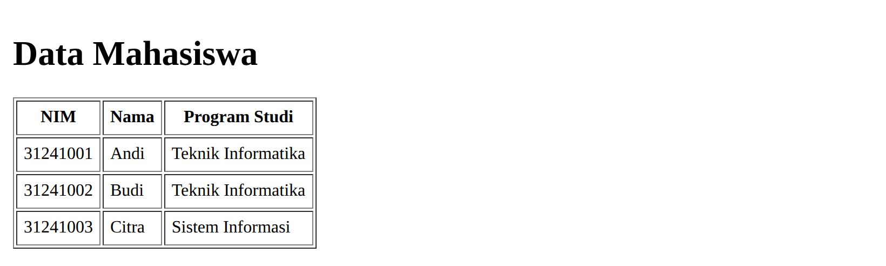
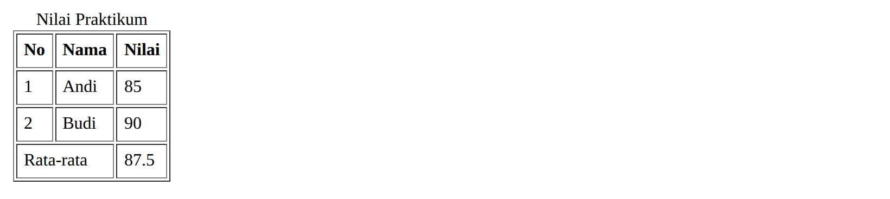
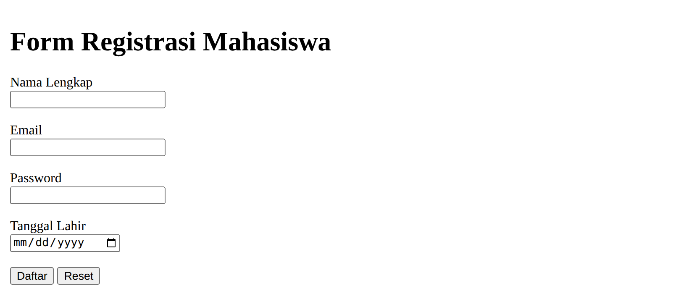
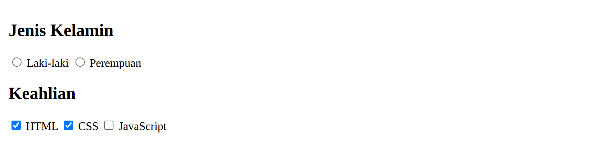
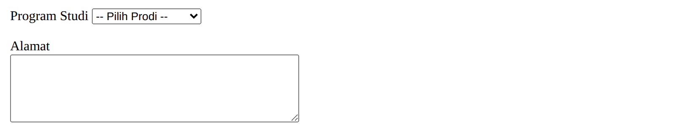
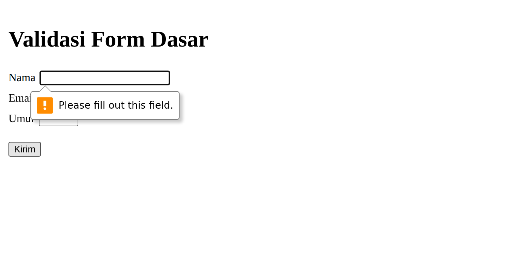
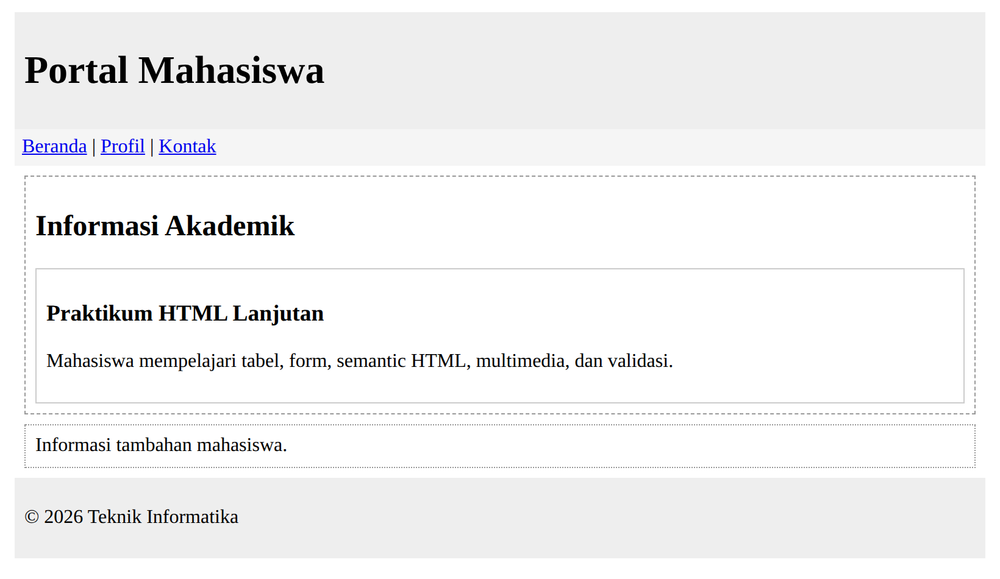
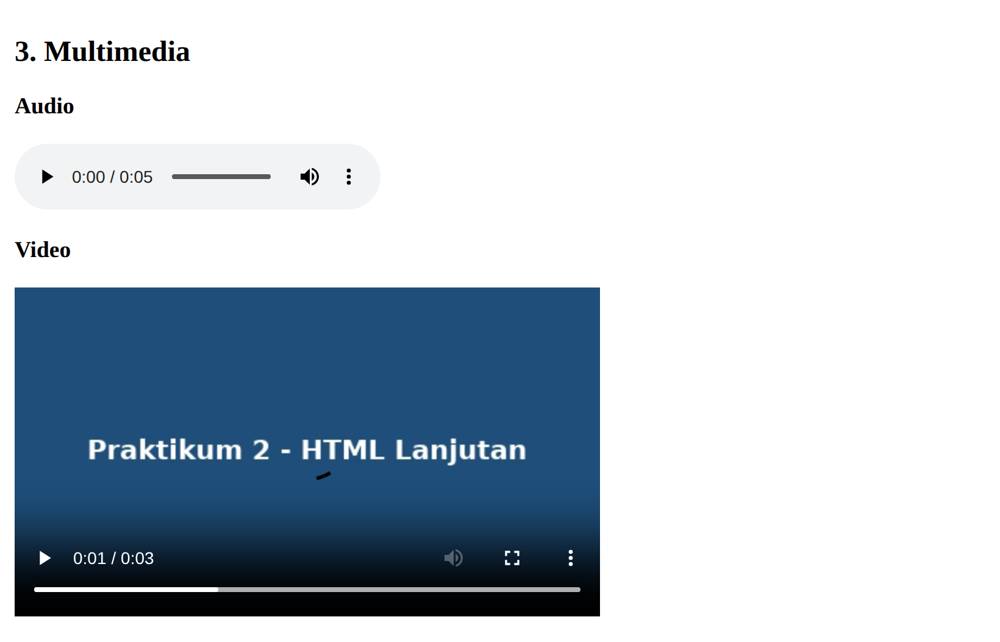
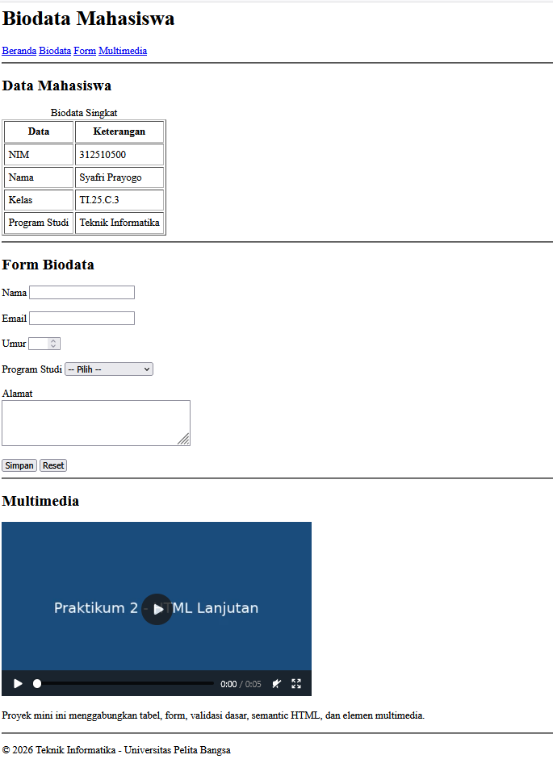

# Laporan Praktikum 2 — HTML Lanjutan

**Mata Kuliah:** Pemrograman Web <br>
**Dosen Pengampu:** Agung Nugroho <br>
**Universitas Pelita Bangsa** — Fakultas Teknik — Teknik Informatika

| Keterangan | Isi |
|---|---|
| Nama | Syafri Prayogo |
| NIM | 312510500 |
| Kelas | TI.25.C.3 |
| Program Studi | Teknik Informatika |

---

## 1. Tujuan Praktikum

1. Mahasiswa mampu memahami penggunaan tabel pada HTML.
2. Mahasiswa mampu memahami penggunaan form dan berbagai jenis input HTML.
3. Mahasiswa mampu menerapkan semantic HTML untuk menyusun struktur halaman.
4. Mahasiswa mampu menambahkan elemen multimedia pada halaman web.
5. Mahasiswa mampu menerapkan validasi form dasar menggunakan atribut HTML.

## 2. Dasar Teori

Praktikum 2 merupakan kelanjutan dari HTML Dasar. Materi difokuskan pada **tabel, form, input, semantic HTML, multimedia, dan validasi form dasar**. Fokus utama tetap pada HTML; CSS dan JavaScript belum menjadi fokus praktikum ini.

- **Tabel** menyajikan data dalam bentuk baris dan kolom (`<table>`, `<tr>`, `<th>`, `<td>`, `<caption>`, serta `<thead>`/`<tbody>`/`<tfoot>`).
- **Form** menerima input pengguna lewat berbagai jenis `<input>`, `<textarea>`, `<select>`, dan `<button>`.
- **Semantic HTML** memakai elemen bermakna (`<header>`, `<nav>`, `<main>`, `<section>`, `<article>`, `<aside>`, `<footer>`).
- **Multimedia** ditampilkan dengan `<audio>` dan `<video>`.
- **Validasi dasar** memakai atribut `required`, `minlength`, `maxlength`, `min`, `max`, `type`, dan `pattern`.

## 3. Alat dan Bahan

| Alat / Bahan | Keterangan |
|---|---|
| Text Editor | Visual Studio Code |
| Web Browser | Google Chrome / Mozilla Firefox |
| Media | `media/audio.mp3` dan `media/video.mp4` |
| Version Control | Git dan GitHub (repository `Lab2Web`) |

---

## 4. Langkah-langkah Praktikum

Setiap tahap disertai kode dan screenshot hasil tampilannya pada browser.

### 4.1 Membuat Tabel Data Mahasiswa

```html
<h1>Data Mahasiswa</h1>
<table border="1">
    <tr><th>NIM</th><th>Nama</th><th>Program Studi</th></tr>
    <tr><td>31241001</td><td>Andi</td><td>Teknik Informatika</td></tr>
    <tr><td>31241002</td><td>Budi</td><td>Teknik Informatika</td></tr>
    <tr><td>31241003</td><td>Citra</td><td>Sistem Informasi</td></tr>
</table>
```



> *Gambar 4.1 — Tabel menampilkan data dalam baris dan kolom; `<th>` tampil tebal sebagai header.*

### 4.2 Mengembangkan Tabel dengan thead, tbody, dan tfoot

Gunakan `<caption>` untuk judul tabel dan `colspan` untuk menggabungkan sel.

```html
<table border="1">
    <caption>Nilai Praktikum</caption>
    <thead><tr><th>No</th><th>Nama</th><th>Nilai</th></tr></thead>
    <tbody>
        <tr><td>1</td><td>Andi</td><td>85</td></tr>
        <tr><td>2</td><td>Budi</td><td>90</td></tr>
    </tbody>
    <tfoot><tr><td colspan="2">Rata-rata</td><td>87.5</td></tr></tfoot>
</table>
```



> *Gambar 4.2 — Tabel dengan caption, bagian head/body/foot, dan `colspan="2"` pada baris Rata-rata.*

### 4.3 Membuat Form Registrasi Mahasiswa

Form memakai beberapa jenis input: `text`, `email`, `password`, `date`, serta tombol `submit` dan `reset`.

```html
<h1>Form Registrasi Mahasiswa</h1>
<form>
    <label for="nama">Nama Lengkap</label><br>
    <input type="text" id="nama" name="nama"><br><br>
    <label for="email">Email</label><br>
    <input type="email" id="email" name="email"><br><br>
    <label for="password">Password</label><br>
    <input type="password" id="password" name="password"><br><br>
    <label for="tanggal">Tanggal Lahir</label><br>
    <input type="date" id="tanggal" name="tanggal"><br><br>
    <button type="submit">Daftar</button>
    <button type="reset">Reset</button>
</form>
```



> *Gambar 4.3 — Form registrasi dengan label terhubung ke input serta tombol Daftar dan Reset.*

### 4.4 Radio Button dan Checkbox

`radio` dipakai untuk memilih **satu** opsi (name sama), `checkbox` untuk memilih **beberapa** opsi.

```html
<h2>Jenis Kelamin</h2>
<input type="radio" id="laki" name="jk" value="L"> <label for="laki">Laki-laki</label>
<input type="radio" id="perempuan" name="jk" value="P"> <label for="perempuan">Perempuan</label>

<h2>Keahlian</h2>
<input type="checkbox" id="html" name="skill" value="HTML"> <label for="html">HTML</label>
<input type="checkbox" id="css" name="skill" value="CSS"> <label for="css">CSS</label>
<input type="checkbox" id="js" name="skill" value="JavaScript"> <label for="js">JavaScript</label>
```



> *Gambar 4.4 — Radio button (pilih satu) dan checkbox (boleh lebih dari satu).*

### 4.5 Select dan Textarea

```html
<label for="prodi">Program Studi</label>
<select id="prodi" name="prodi">
    <option value="">-- Pilih Prodi --</option>
    <option value="ti">Teknik Informatika</option>
    <option value="si">Sistem Informasi</option>
</select>
<br><br>
<label for="alamat">Alamat</label><br>
<textarea id="alamat" name="alamat" rows="5" cols="40"></textarea>
```



> *Gambar 4.5 — Dropdown `<select>` berisi pilihan prodi dan `<textarea>` untuk teks panjang.*

### 4.6 Validasi Form Dasar

Tambahkan atribut `required`, `minlength`, `min`, dan `max`. Saat tombol Kirim ditekan tanpa mengisi data, browser menampilkan pesan validasi bawaan.

```html
<form>
    <label for="nama">Nama</label>
    <input type="text" id="nama" name="nama" required minlength="3">
    <label for="email">Email</label>
    <input type="email" id="email" name="email" required>
    <label for="umur">Umur</label>
    <input type="number" id="umur" name="umur" min="17" max="60" required>
    <button type="submit">Kirim</button>
</form>
```



> *Gambar 4.6 — Pesan validasi bawaan browser ("Please fill out this field.") muncul saat input wajib dikosongkan.*

### 4.7 Membuat Halaman Semantic HTML

```html
<header><h1>Portal Mahasiswa</h1></header>
<nav>
    <a href="#">Beranda</a> <a href="#">Profil</a> <a href="#">Kontak</a>
</nav>
<main>
    <section>
        <h2>Informasi Akademik</h2>
        <article>
            <h3>Praktikum HTML Lanjutan</h3>
            <p>Mahasiswa mempelajari tabel, form, semantic HTML, multimedia, dan validasi.</p>
        </article>
    </section>
    <aside>Informasi tambahan mahasiswa.</aside>
</main>
<footer><p>&copy; 2026 Teknik Informatika</p></footer>
```



> *Gambar 4.7 — Struktur semantic: header, nav, main (section + article), aside, dan footer.*

### 4.8 Menambahkan Multimedia

File media disimpan di folder `media/`.

```html
<h2>Audio</h2>
<audio controls>
    <source src="media/audio.mp3" type="audio/mpeg">
    Browser tidak mendukung audio.
</audio>

<h2>Video</h2>
<video controls width="480">
    <source src="media/video.mp4" type="video/mp4">
    Browser tidak mendukung video.
</video>
```



> *Gambar 4.8 — Elemen `<audio>` dan `<video>` tampil lengkap dengan kontrol pemutar.*

### 4.9 Proyek Mini — Biodata Mahasiswa (`biodata.html`)

Menggabungkan semua materi: semantic structure, tabel data, form dengan validasi, select/textarea, dan satu elemen multimedia.



> *Gambar 4.9 — Halaman `biodata.html` yang menggabungkan seluruh materi Praktikum 2.*

---

## 5. Jawaban Pertanyaan

**1. Apa fungsi `<table>`, `<tr>`, `<th>`, dan `<td>`?**
`<table>` membuat struktur tabel, `<tr>` membuat baris (table row), `<th>` membuat sel header (tebal dan rata tengah), `<td>` membuat sel data biasa.

**2. Apa perbedaan `<th>` dan `<td>`?**
`<th>` adalah sel header — teksnya tebal dan rata tengah secara default, dipakai sebagai judul kolom/baris. `<td>` adalah sel data biasa untuk isi tabel.

**3. Apa fungsi `colspan` pada tabel?**
Menggabungkan beberapa kolom menjadi satu sel. Contoh `colspan="2"` membuat satu sel selebar dua kolom (dipakai pada baris "Rata-rata").

**4. Apa fungsi `<form>` dalam HTML?**
Menampung elemen input untuk menerima dan mengirim data dari pengguna ke server (atau diproses lebih lanjut). Form membungkus input, label, select, textarea, dan tombol.

**5. Apa perbedaan radio button dan checkbox?**
Radio button (name sama) hanya mengizinkan **satu** pilihan dalam satu grup. Checkbox mengizinkan **nol, satu, atau beberapa** pilihan sekaligus.

**6. Mengapa `<label>` sebaiknya terhubung dengan id input melalui atribut `for`?**
Agar klik pada teks label otomatis memfokuskan/mengaktifkan input terkait, meningkatkan kemudahan penggunaan dan aksesibilitas (penting untuk screen reader). Nilai `for` harus sama dengan `id` input.

**7. Apa perbedaan `<textarea>` dengan input type text?**
`<input type="text">` untuk teks **satu baris**, sedangkan `<textarea>` untuk teks **banyak baris** (bisa diatur `rows` dan `cols`), cocok untuk alamat atau komentar panjang.

**8. Apa fungsi semantic HTML (`<header>`, `<nav>`, `<main>`, `<section>`, `<article>`, `<aside>`, `<footer>`)?**
Memberi makna yang jelas pada struktur halaman: `<header>` kepala halaman, `<nav>` navigasi, `<main>` konten utama, `<section>` kelompok konten, `<article>` konten mandiri, `<aside>` konten pelengkap, `<footer>` kaki halaman. Berguna untuk keterbacaan kode, aksesibilitas, dan SEO.

**9. Apa fungsi `required`, `min`, `max`, dan `minlength`?**
`required` membuat input wajib diisi; `min`/`max` menentukan nilai minimum/maksimum (untuk angka/tanggal); `minlength` menentukan panjang minimum karakter teks.

**10. Apa perbedaan elemen `<audio>` dan `<video>`?**
`<audio>` memutar berkas suara saja (tanpa tampilan gambar), sedangkan `<video>` memutar berkas video dengan tampilan gambar dan dapat diatur ukurannya (`width`/`height`). Keduanya memakai atribut `controls` dan elemen `<source>`.

---

## 6. Struktur Output Repository

```
Lab2Web/
├── index.html        # halaman utama (tabel, form, multimedia, semantic)
├── biodata.html      # proyek mini biodata (gabungan semua materi)
├── media/
│   ├── audio.mp3
│   └── video.mp4
├── screenshots/      # hasil screenshot tiap tahap
└── README.md         # laporan / dokumentasi praktikum
```

## 7. Checklist Penyelesaian

- [x] Tabel berhasil ditampilkan dan memiliki header yang sesuai.
- [x] Form memiliki label dan beberapa jenis input.
- [x] Radio button dan checkbox sudah digunakan.
- [x] Select dan textarea sudah digunakan.
- [x] Validasi `required` dan validasi dasar lainnya sudah dicoba.
- [x] Semantic HTML sudah digunakan.
- [x] Audio dan/atau video berhasil ditampilkan.
- [x] Proyek mini biodata menggabungkan materi utama.
- [x] Screenshot dan README.md sudah tersedia.
- [x] Repository siap di-commit dan URL siap dikirim.

## 8. Kesimpulan

Melalui Praktikum 2 ini telah dipahami penggunaan **tabel** untuk menyajikan data, **form** beserta berbagai jenis input dan elemen pendukungnya (radio, checkbox, select, textarea), penerapan **semantic HTML** untuk menyusun struktur halaman yang bermakna, penambahan **multimedia** melalui `<audio>` dan `<video>`, serta **validasi form dasar** memakai atribut HTML.

Seluruh materi digabung pada proyek mini `biodata.html`. Hasil setiap tahap sesuai harapan saat diuji pada browser dan struktur HTML sudah valid (tag seimbang).

> Catatan: file `video.mp4` menggunakan codec H.264 sehingga tampil normal di Google Chrome / Firefox. Pada sebagian browser berbasis Chromium build terbuka, frame video mungkin tidak muncul walau kontrol tetap tampil.
